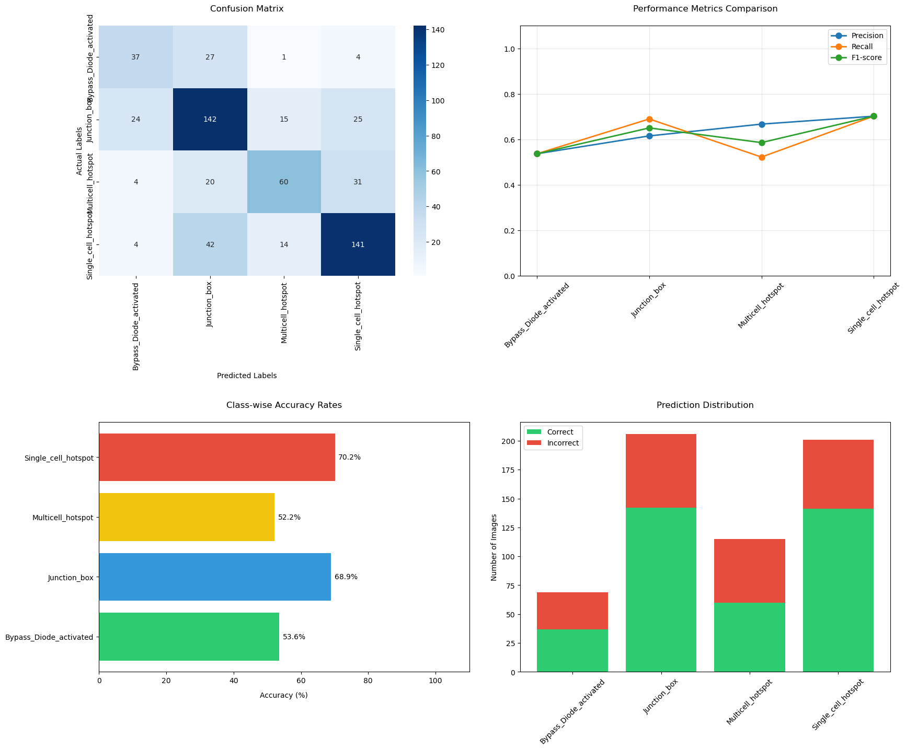
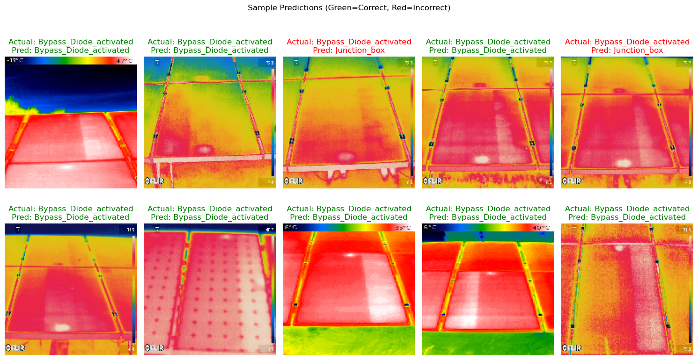

# Solar Fault Classifier

This project implements a Convolutional Neural Network (CNN) for classifying solar panel faults from images. The model detects four types of faults:
- Bypass Diode Activated
- Junction Box
- Multicell Hotspot
- Single Cell Hotspot

## Project Structure

```
.
├── app.ipynb              # Jupyter notebook for model training
├── test.ipynb             # Jupyter notebook for model evaluation
└── images_classed.7z      # Compressed image dataset (use Git LFS)
```

## Installation

## Important Notes
- This repository uses Git LFS for large files:
  - You must install Git LFS before cloning
  - Files bigger than 100MB will show as pointers without LFS
- Dataset must be extracted from `images_classed.7z` before use
- Download 7z from [here](https://www.7-zip.org/)

1. **Clone the repository with Git LFS**:
   ```bash
   git lfs install  # Required for large files
   git clone https://github.com/obk/Solar-Fault-Classifier
   ```

2. **Extract the dataset**:
   ```bash
   7z x images_classed.7z  # Requires 7zip installed
   ```

3. **Install dependencies**:
   ```bash
   pip install -r requirements.txt
   ```
*Note: A GPU is recommended for faster training.*

## Usage

### 1. Model Training (`app.ipynb`)
1. Ensure extracted dataset in `images_classed/` directory with subfolders for each class
2. Run all cells in `app.ipynb`:
   - Trains CNN model with data augmentation
   - Monitors training progress through accuracy/loss metrics
   - Saves final model as `solar_fault_classifier.h5`

### 2. Model Evaluation (`test.ipynb`)
1. Execute all cells in `test.ipynb`:
   - Evaluates model performance (using same images due to data limitations)
   - Displays accuracy metrics and visualizations
   - Shows prediction comparisons with actual labels



### 3. Prediction Examples


## Key Components
- `app.ipynb`: Model training notebook
  - CNN architecture with convolutional layers and dropout
  - Uses ImageDataGenerator for augmentation/validation
  - Saves trained model weights

- `test.ipynb`: Model evaluation notebook
  - Loads pretrained model
  - Generates performance metrics
  - Creates visualizations of predictions

- Dataset structure (`images_classed/`):
  ```
  images_classed/
  ├── Bypass_Diode_activated
  ├── Junction_box
  ├── Multicell_hotspot
  └── Single_cell_hotspot
  ```

For questions or issues, please open an issue in the repository.
